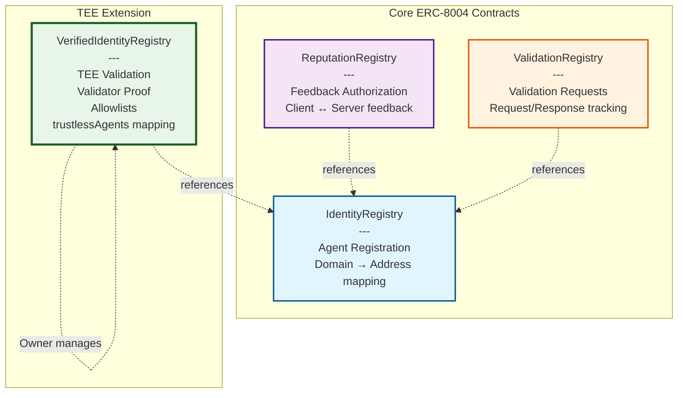
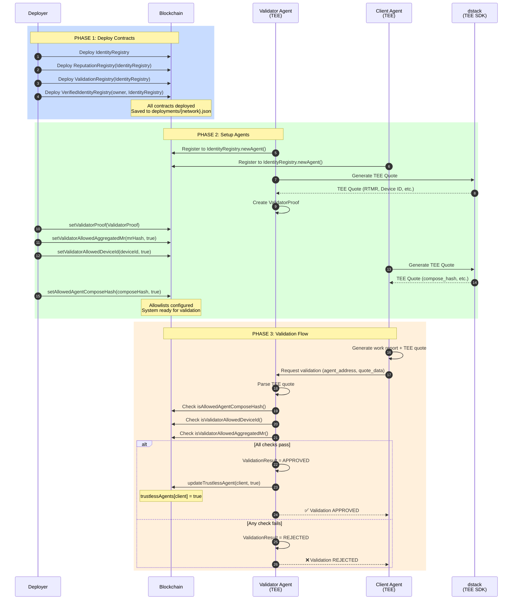
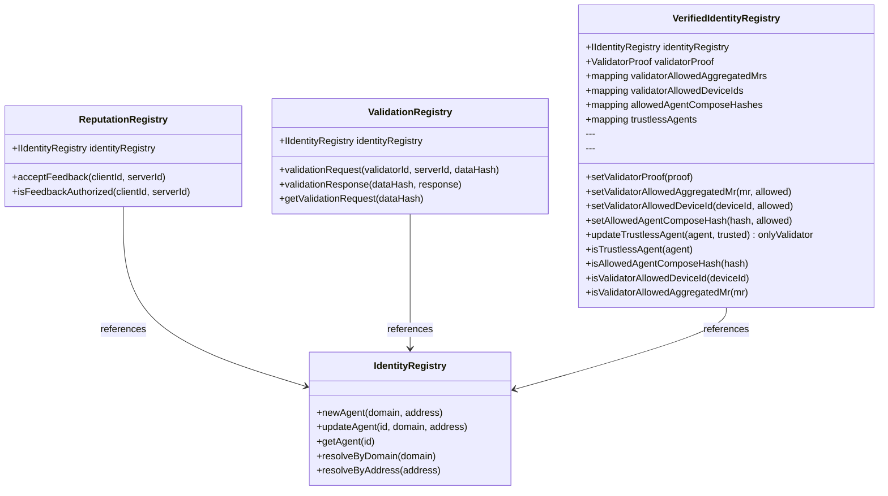
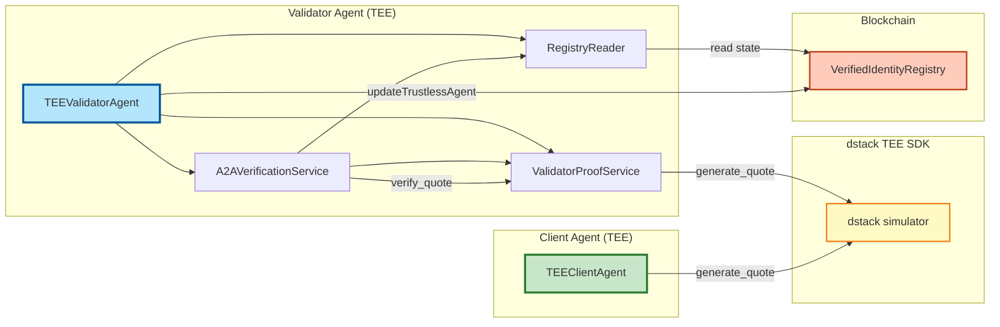
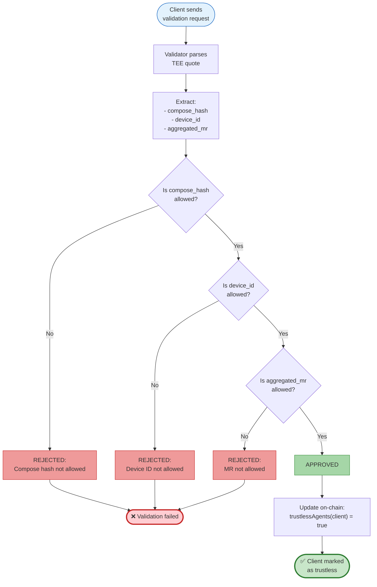
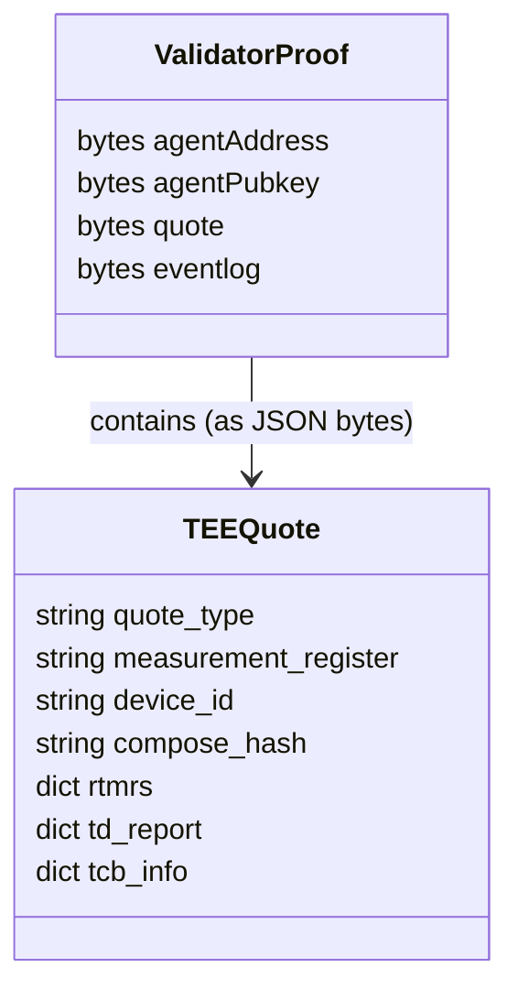
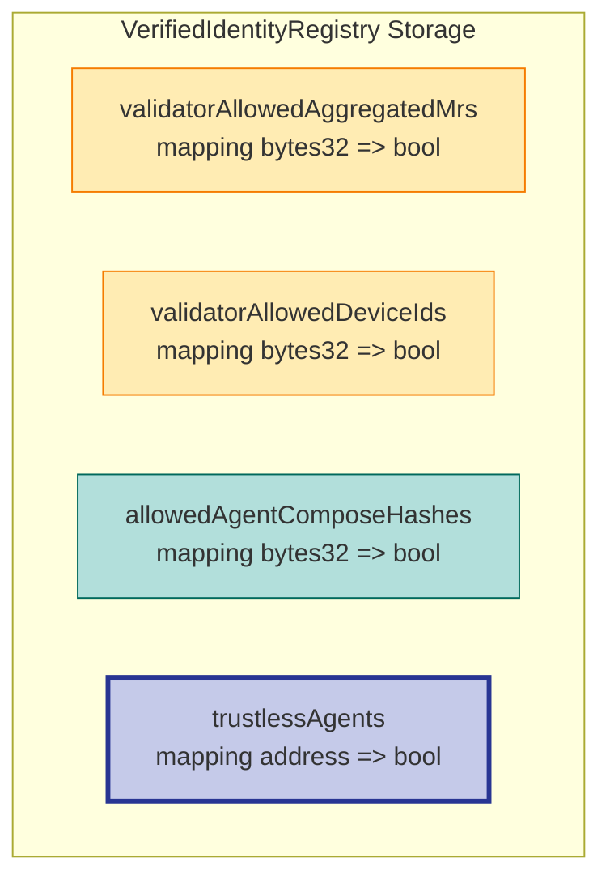
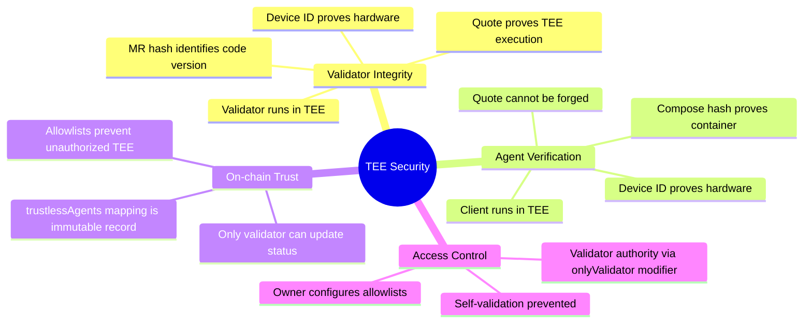
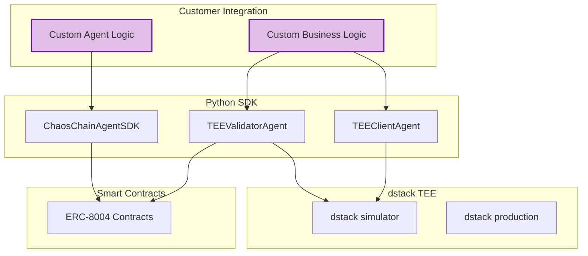

# TEE Validator Architecture & Flow

This document provides a comprehensive visualization of the ChaosChain TEE Validation system architecture and workflow.

## Contract Architecture



**Key Relationships:**
- **IdentityRegistry**: Base registry - all other contracts reference it for agent lookups
- **ReputationRegistry**: Manages feedback authorization between agents
- **ValidationRegistry**: Handles validation requests and responses
- **VerifiedIdentityRegistry**: TEE-focused contract managing validator proofs and trustless agent registry

---

## TEE Validation Demo Flow

### Overview: Three-Phase Process



---

## Detailed Component Interactions

### Contract Relationship Details



---

## TEE Components Architecture



---

## Validation Decision Logic



---

## Key Data Structures

### ValidatorProof



### Allowlist Mappings



---

## Usage Scenarios

### Scenario 1: Local Testing (Anvil)

```bash
# One-command demo
python tee_validation_demo.py run-all --network local
```

- Starts Anvil testnet automatically
- Uses deterministic test accounts
- Fast iteration for development

### Scenario 2: Customer Showcase (Multi-step on Base Sepolia)

```bash
# Step 1: Deploy infrastructure
python tee_validation_demo.py deploy --network base-sepolia

# Step 2: Register agents and configure allowlists
python tee_validation_demo.py setup-agents --network base-sepolia

# Step 3: Run live validation
python tee_validation_demo.py validate --network base-sepolia
```

- Separated steps for demonstration clarity
- Deployment state saved in `deployments/base-sepolia.json`
- Can run validation multiple times without redeployment

### Scenario 3: Multi-chain Deployment

Networks supported:
- `local` - Anvil testnet (Chain ID: 31337)
- `base-sepolia` - Base Sepolia testnet (Chain ID: 84532)
- `sepolia` - Ethereum Sepolia (Chain ID: 11155111)
- `optimism-sepolia` - Optimism Sepolia (Chain ID: 11155420)

---

## Security Guarantees



---

## Performance Characteristics

| Operation | Gas Cost (est.) | Notes |
|-----------|----------------|-------|
| Deploy IdentityRegistry | ~2,000,000 | One-time setup |
| Deploy VerifiedIdentityRegistry | ~3,000,000 | One-time setup |
| Register agent | ~150,000 | Per agent |
| Set validator proof | ~200,000 | One-time per validator |
| Configure allowlist | ~50,000 | Per allowlist entry |
| Update trustless status | ~100,000 | Per validation |
| Read trustless status | ~2,300 | View function (free) |

---

## Integration Points



**Customer can extend:**
- Custom validation logic in `A2AVerificationService.verify_agent()`
- Additional allowlist checks
- Custom work report formats
- Integration with existing agent frameworks

---

## Deployment Configuration

Deployment state is saved per network in `deployments/{network}.json`:

```json
{
  "network": "base-sepolia",
  "chain_id": 84532,
  "rpc_url": "https://...",
  "contracts": {
    "identity_registry": "0x...",
    "reputation_registry": "0x...",
    "validation_registry": "0x...",
    "verified_identity_registry": "0x..."
  },
  "agents": {
    "validator": {
      "address": "0x...",
      "domain": "validator.base-sepolia"
    },
    "client": {
      "address": "0x...",
      "domain": "client.base-sepolia"
    }
  },
  "validator_proof": { "..." },
  "client_quote": { "..." },
  "validations": [
    {
      "timestamp": 1234567890,
      "report_id": "report_...",
      "status": "approved"
    }
  ]
}
```

This enables persistent multi-step demos and verification of historical validations.